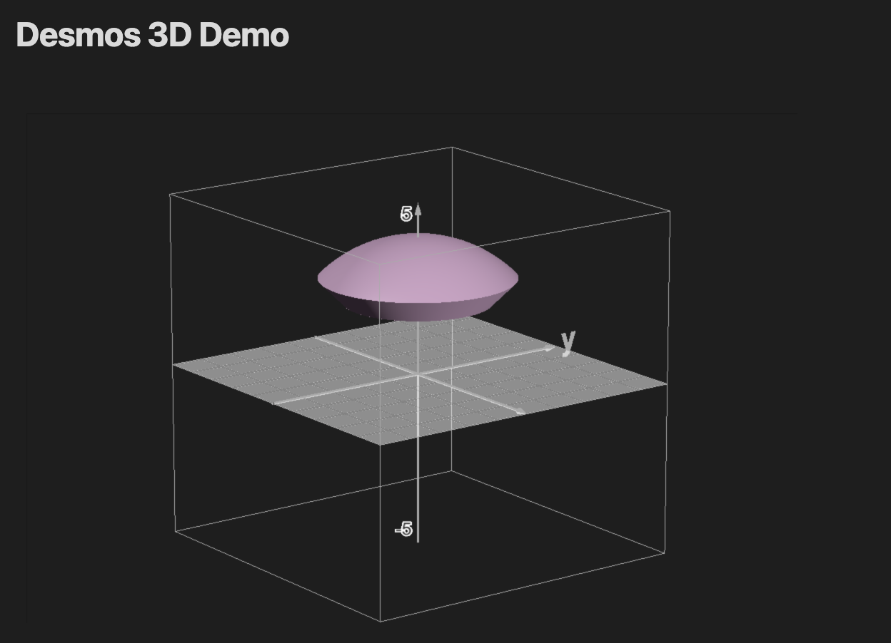

# Obsidian Desmos 3D



A fork of [Obsidian Desmos](https://github.com/Nigecat/obsidian-desmos) that adds **3D graphing** support using [Desmos 3D](https://www.desmos.com/3d). Render both 2D and 3D mathematical graphs directly in your Obsidian notes.

## Usage

Create a fenced codeblock with the language set to `desmos-graph` (2D) or `desmos-graph-3d` (3D). The block has two sections separated by `---`: **settings** (optional) above the separator, and **equations** below it. If you have no settings, you can omit the `---` and write equations directly.

### Basic Structure

````
```desmos-graph-3d
setting1=value1; setting2=value2
---
equation1
equation2
```
````

Settings are `key=value` pairs separated by `;` or newlines. Equations go one per line after the `---`.

## Settings

### Common Settings (2D and 3D)

| Setting | Type | Default | Description |
|---------|------|---------|-------------|
| `width` | number | `600` | Graph width in pixels |
| `height` | number | `400` | Graph height in pixels |
| `degreeMode` | `radians` / `degrees` | `radians` | Angle mode for trig functions |
| `defaultColor` | color | — | Default color applied to all equations |

### 2D Settings (`desmos-graph`)

| Setting | Type | Default | Description |
|---------|------|---------|-------------|
| `left` | number | `-10` | Left boundary |
| `right` | number | `10` | Right boundary |
| `bottom` | number | `-7` | Bottom boundary |
| `top` | number | `7` | Top boundary |
| `grid` | boolean | `true` | Show gridlines |
| `hideAxisNumbers` | boolean | `false` | Hide axis tick labels |
| `xAxisLabel` | string | — | Label for x-axis |
| `yAxisLabel` | string | — | Label for y-axis |
| `xAxisLogarithmic` | boolean | `false` | Logarithmic x-axis |
| `yAxisLogarithmic` | boolean | `false` | Logarithmic y-axis |

### 3D Settings (`desmos-graph-3d`)

| Setting | Type | Default | Description |
|---------|------|---------|-------------|
| `showGrid` | boolean | `true` | Show the grid |
| `showAxis` | boolean | `true` | Show the axes |
| `xAxisLabel` | string | — | Label for x-axis |
| `yAxisLabel` | string | — | Label for y-axis |
| `zAxisLabel` | string | — | Label for z-axis |
| `locked` | boolean | `false` | Lock the graph to prevent interaction (enables caching) |

## Equation Syntax

Each equation line follows this format:

```
expression|restriction|style|color|label:text
```

Segments are separated by `|`. Only the expression is required — everything else is optional and order-flexible.

### Expressions

Write any valid Desmos expression:

```
y=x^2
x^2+y^2=1
9<x^{2}+y^{2}+z^{2}<16
```

### Restrictions

Add conditions to limit where an equation is drawn:

```
y=x^2|x>0
y=\sin(x)|-5<x<5
```

### Styles

| Style | Description |
|-------|-------------|
| `SOLID` | Solid line (default) |
| `DASHED` | Dashed line |
| `DOTTED` | Dotted line |
| `NOLINE` | No line |
| `POINT` | Filled point |
| `OPEN` | Open (hollow) point |
| `CROSS` | Cross point |

### Colors

Use any named color or a hex code:

`red`, `green`, `blue`, `yellow`, `magenta`, `cyan`, `purple`, `orange`, `black`, `white`

```
y=x^2|blue
y=\sin(x)|#ff6600
```

If no color is specified, the plugin uses Obsidian's theme colors or Desmos defaults.

### Labels

Add a label to an equation with the `label:` prefix:

```
(1,2)|POINT|label:Point A
```

### Hidden Equations

Use the `HIDDEN` keyword to define an equation without displaying it (useful for helper expressions):

```
a=5|HIDDEN
y=a*x
```

## Features

- **Interactive 3D graphs** — 3D graphs with `locked=false` (the default) are fully interactive: rotate, zoom, and pan. Camera position is preserved between renders.
- **Cached graphs** — Locked graphs and all 2D graphs are rendered as static images (SVG for 2D, PNG for 3D) and cached for performance.
- **Theme integration** — Graph axes and gridlines automatically match your Obsidian theme colors.
